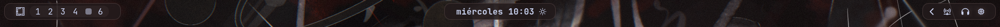
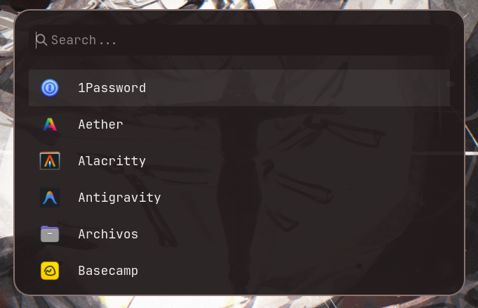

# 🌍 Omarchy Terra Islands

Un tema minimalista y orgánico para Omarchy Linux. Utiliza un diseño de **islas flotantes** con una paleta de colores cálida inspirada en tonos tierra y arcilla.

> **Nota sobre los colores:** Los colores de este tema (fondo `#221A1B`, acentos `#8A736F`) son **fijos**. Han sido diseñados específicamente para combinar con fondos de pantalla de tonos cálidos/tierra. Si cambias tu fondo de pantalla por uno muy diferente, los colores de la barra y el menú seguirán siendo tonos tierra a menos que los edites manualmente.

## ✨ Características (ES)
- **Terra Floating Islands:** La Waybar se divide en secciones flotantes con transparencias.
- **Menú Walker:** El menú principal y de búsqueda tiene los mismos colores cálidos y bordes redondeados suaves (24px) para una integración perfecta con la barra.
- **Organic Accents:** Colores cálidos que armonizan con fondos de pantalla naturales.
- **Premium Geometry:** Bordes suavizados para una interfaz menos agresiva.

🌍 Omarchy Terra Islands (English)
A minimalist and organic theme for Omarchy Linux. It features a floating islands design with a warm color palette inspired by earth and clay tones.

Color Note: The colors in this theme (background #221A1B, accents #8A736F) are fixed. They were specifically designed to match warm/earthy wallpapers. They do not automatically adapt to new wallpapers if you change them.

✨ Features (EN)
Terra Floating Islands: The Waybar is divided into floating sections with transparent gaps.
Walker Menu: The main application and search menu (Walker) shares the same warm colors and features smooth 24px rounded corners for seamless integration.
Organic Accents: Warm colors that harmonize with natural and earthy wallpapers.
Premium Geometry: Smoothed borders for a less aggressive, premium UI.

## 📸 Demostración
- 
- 

## 🛠️ Instalación rápida

```bash
git clone https://github.com/EmaBilibili/omarchy-terra-islands.git
cd omarchy-terra-islands
chmod +x install.sh
./install.sh
